# ST0256 Tópicos Especiales en Telemática - Laboratorios

## Estudiante
- **Nombre:** Andrés Julian Caro Restrepo
- **Correo:** ajcaror@eafit.edu.co

## Profesor
- **Nombre:** Alvaro Enrique Ospina Sanjuan
- **Correo:** aeospinas@eafit.edu.co

------------
<br/>

# Contenido
- [EMR Setup](#emr-setup)
- [Laboratorio 1](#laboratorio-1)
- [Laboratorio 2](#)
- [Laboratorio 3](#)

------------
<br/>

# EMR Setup

Para la creación del clúster de Amazon EMR que utilizaremos para el desarrollo de los laboratorios seguiremos los siguientes pasos:


## 1. Crear bucket S3
Una vez nos encontremos en la consola de AWS buscaremos el servicio de S3


Nos dirigimos a la sección de buckets y allí le daremos click a `Create Bucket`.


Le daremos un nombre al bucket. Éste debe contener de 3 a 63 caracteres, ser único en el mundo y no debe contener mayúsculas. Para nuestro laboratorio hemos decidido nombrarlo `ajcarornotebooks`.


Para el desarrollo, hemos desactivado la opción de `Block all public access`.


Luego de esto procedemos a crear el bucket. Lo cual se debe ver reflejado de la siguiente manera:


## 2. Crear clúster EMR
Ya con nuestro bucket creado ahora sí podremos crear nuestro clúster de EMR. Para ello, nos dirigimos a dicho servicio.


En la sección de `Clústers` podemos ver los que hemos creado con anterioridad (si es el caso). Le damos click a `Create clúster`.


Aquí le daremos un nombre a nuestro clúster, seleccionaremos la versión de Amazon EMR y las aplicaciones que queremos sean instaladas en el clúster. Para nuestro caso, elegimos:
+ **Name:** `bigdata-labs-cluster`
+ **Versión:** `emr-6.14.0`
+ **Aplicaciones:**
  - [x] `Flink 1.17.1`
  - [x] `HCatalog 3.1.3`
  - [x] `Hue 4.11.0`
  - [x] `Livy 0.7.1`
  - [x] `Spark 3.4.1`
  - [x] `Tez 0.10.2`
  - [x] `ZooKeeper 3.5.10`
  - [x] `Hadoop 3.3.3`
  - [x] `JupyterEnterpriseGateway 2.6.0`
  - [x] `Sqoop 1.4.7`
  - [x] `Hive 3.1.3`
  - [x] `JupyterHub 1.5.0`
  - [x] `Zeppelin 0.10.1`

Además, es muy importante que activemos las casillas:
- `Use for Hive table metadata`
- `Use for Spark table metadata`

El resto de opciones las dejamos con su valor por defecto.


Aquí seleccionamos los tipos de instancias que deseamos para el clúster. Podemos dejarla en las máquimnas default `m5.xlarge`, sin embargo, con éstas en ocasiones la creación del clúster falla porque dependemos de la disponibilidad de las mismas. Es por ello que en nuestro caso hemos elegido las `m4.xlarge`.


Dejamos las siguientes opciones con sus valores por defecto:


Y en el apartado de `Software settings` enlazaremos el bucket s3 que creamos en el [paso 1](#1-crear-bucket-s3).
Para ello, añadiremos el siguiente json:
```json
[
  {
    "Classification": "jupyter-s3-conf",
    "Properties": {
      "s3.persistence.enabled": "true",
      "s3.persistence.bucket": "ajcarornotebooks"
    }
  }
]
```
**Nota:** Asegurate de reemplazar `ajcarornotebooks` por el nombre de tu bucket s3.


Asignamos una key pair. Puedes seleccionar una ya existente o crear una nueva.


En esta sección seleccionamos los roles con los que vamos a trabajar. En nuestro caso, hemos seleccionado los siguientes:
- **Service role:** `EMR_DefaultRole`
- **Instance profile:** `EMR_EC2_DefaultRole`
- **Custom automatic scaling role:** `LabRole`


Revisamos el resumen de la configuración de instalación del clúster y si todo se encuentra acorde a lo que deseamos le damos en `Create cluster`.


## 3. Configuración de acceso al clúster

La creación del clúster puede tomar entre 12 y 20 minutos. Mientras se realiza su instalación, podemos dirigirnos a `Block public access`, darle en `Edit` y `Turn off` para permitir la apertura de los puertos necesarios para las aplicaciones. Le damos en `Save`. Tener en consideración que esto no se debe realizar en un entorno de producción, pues lo debido en dichos ambientes es tener la seguridad pertinente.


Una vez el clúster se haya creado lo debemos ver algo así:


Y ya podremos dirigirnos hacia EC2 para configurar los grupos de seguridad de las instancias.


Identificamos la instancia `master` gracias a la columna `Security group name` y entramos en ella.


Aquí nos dirigiremos hacia la pestaña de `Security` y al Security group en cuestión.


Entramos a `Edit inbound rules` y añadimos la regla `All traffic`. (Reiterar que no pertinente para producción).


## 4. Parche de acceso a Hue

Siempre que iniciemos el clúster debemos realizar este proceso para arreglar el acceso a Hue. Para ello, nos conectaremos mediante SSH a nuestra instancia `master` y editaremos el archivo `hue.ini` con el siguiente comando:

```bash
vim /etc/hue/conf/hue.ini
```


Aquí buscaremos la linea que necesitamos editar y lo haremos con:

```bash
/webhdfs_url
```


Al encontrar la linea que necesitamos presionaremos `Enter`, luego la tecla `I` y cambiaremos el puerto `14000` por el `9870`. Con lo cual se nos debe ver así:


Una vez realizado el cambio presionamos `ESC` y digitamos `:x` para guardar y salir.
Después, reiniciaremos el servicio con el comando:
```bash
sudo systemctl restart hue.service
```


## 5. Validar acceso correcto a las aplicaciones

Para verificar que todo se encuentra en orden podemos entrar a Hue, JupyterHub y Zeppelin para probar el acceso. Para ello nos dirigimos nuevamente a nuestro clúster e ingresamos a la pestaña de `Applications`, donde podremos encontrar los diferentes enlaces para cada aplicación.


Entraremos al enlace de `Hue` y en esta interfaz desdes nuestro browser debemos ingresar `hadoop` como usuario y crear nuestra propia contraseña que cumpla con los criterios.


Una vez dentro podremos acceder, por ejemplo, al apartado de s3 y ver que allí se encuentra enlazado el bucket que creamos.


Ahora intentemos ingresar a JupyterHub siguiendo su respectivo enlace. Aquí ingresaremos con `jovyan` como usuario y `jupyter` como contraseña.


Ahora podemos crear un nuevo notebook de PySpark.


Y podemos observar como nuestro ambiente se ejecuta de manera correcta.


Ahora, dirigiendonos al enlace de Zeppelin podremos ingresar de manera directa como anónimo (sin necesidad de login).


Podemos crear un nuevo notebook con `spark` como intérprete.


Y de forma similar a como lo hicimos en JupyterHub, validar la correcta ejecución de las variables.


Siendo así, ya hemos configurado correctamente nuestro clúster.


## 6. Clonar clúster EMR

Cada vez que el clúster se termine no se puede volver a iniciar, es por esto que debemos ya sea crear uno nuevo, o como podemos ver, clonar uno que existió. Lo único que debemos hacer es seleccionar el cluster en estado "Terminated" y darle en `Clone`.


Aquí podremos cambiar alguna configuración en caso de requerirlo y luego dar click en `Clone cluster`.


De la misma forma a la creación, tendremos que esperar a que se inicialice nuestro clúster. Una vez terminado, debemos repetir el proceso de [parche de acceso a hue](#4-parche-de-acceso-a-hue) y crear la cuenta de Hue.


------------
<br/>

# Laboratorio 1

Para el desarrollo de este primer laboratorio, una vez ya configuramos todos los pasos anteriores, podemos ingresar mediante SSH a nuestra instancia `master` y ejecutar los siguientes comandos:

- `sudo yum update -y`
- `sudo yum install git -y`
- `git --version`
- `git clone https://github.com/st0263eafit/st0263-241.git`
- `hdfs dfs -mkdir /user/hadoop/datasets`
- `hdfs dfs -copyFromLocal ~/st0263-241/bigdata/datasets/* /user/hadoop/datasets`
- `hdfs dfs -ls /user/hadoop/datasets`

Con éstos lo que estamos haciendo es realizar la actualización de los paquetes, instalar git, clonar el repositorio del curso y luego copiar los datos de 'datasets' hacia nuestro hdfs. Para ello ejecutamos los comandos que contienen 'mkdir' 'copyFromLocal' y validamos con 'ls'.
A continuación tienes imágenes de cómo se debería ver el proceso:
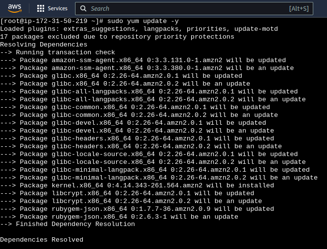
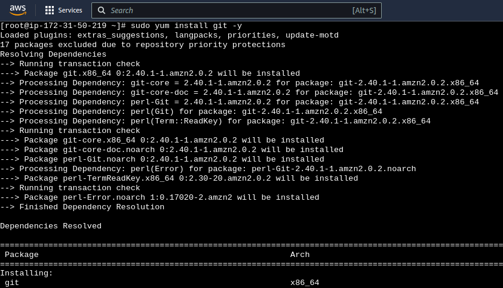
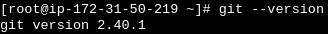
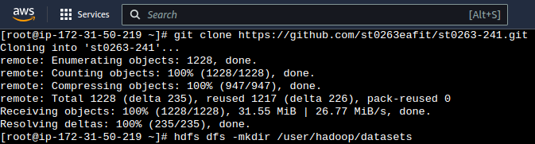
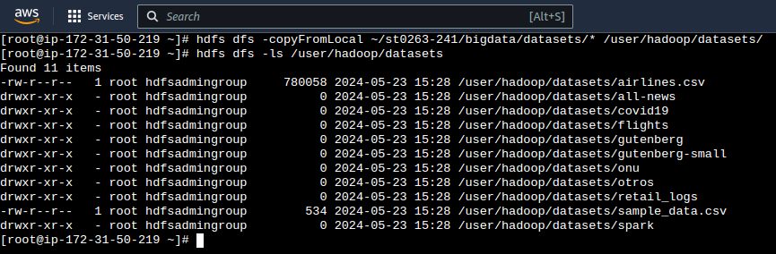

Luego podemos verificar también que el proceso se haya realizado satisfactoriamente desde la UI de Hue ingresando en el apartado de `Files`, el cual hace referencia a nuestro hdfs.
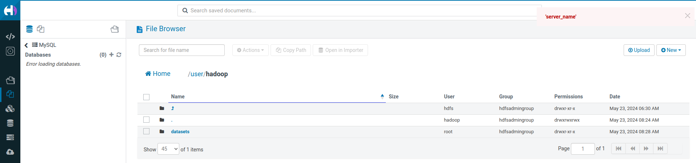

El proceso de copiar archivos que acabamos de realizar se puede realizar tanto mediante la consola como mediante la interfaz que nos provee Hue. Ya vimos la primera forma, así que veamos la segunda copiando éstos mismos archivos pero a nuestro s3. Para ello nos dirigimos a nuestro s3 e ingresamos al bucket.
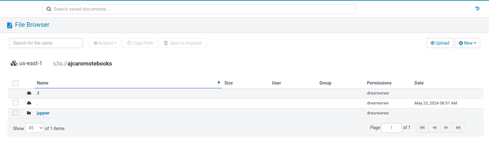

En nuestra máquina local debemos clonar el repositorio del curso. Para ello podemos usar el mismo comando presentado anteriormente:
- `git clone https://github.com/st0263eafit/st0263-241.git`

O el siguiente si tienes configurado SSH en tu máquina local:
- `git clone git@github.com:st0263eafit/st0263-241.git`

Luego, ya podrás arrastrar la carpeta 'datasets' en tu bucket.
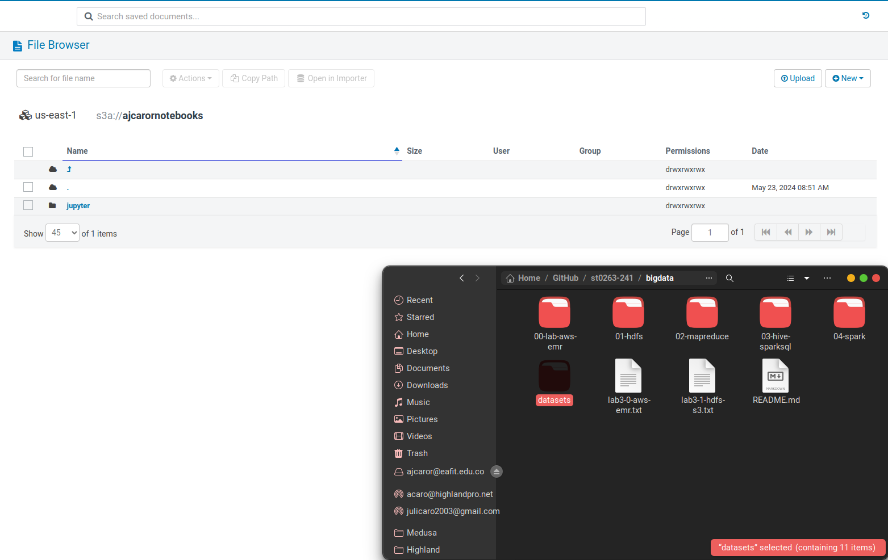

Y se realizará la carga de los archivos así:
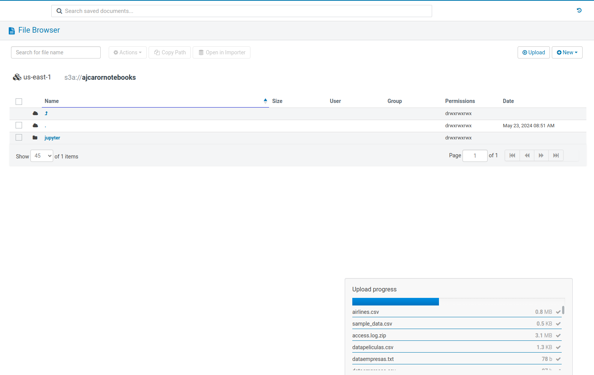

Lo cual ya podrás comprobar allí mismo en Hue o incluso en el apartado de s3 de AWS.
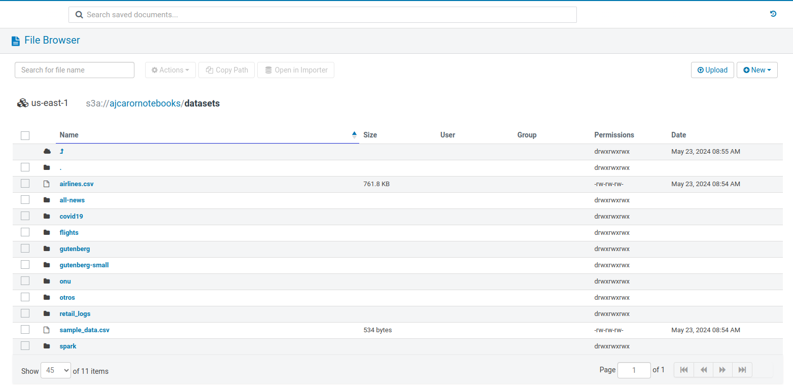
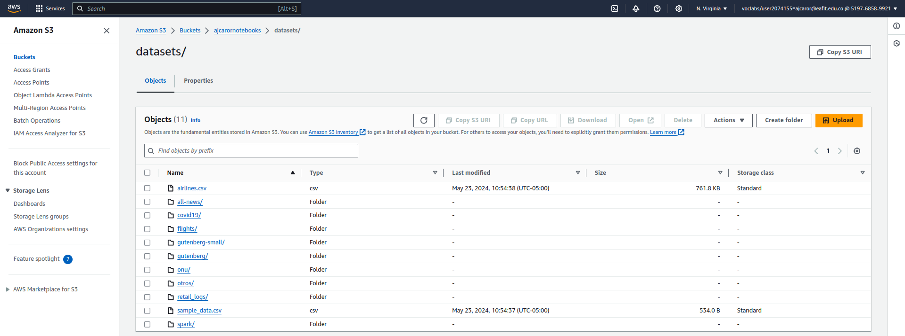

------------
<br/>

